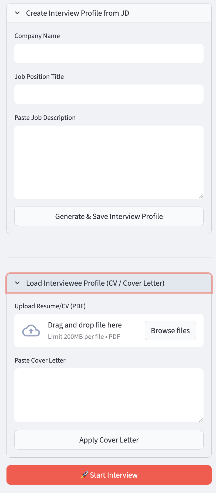
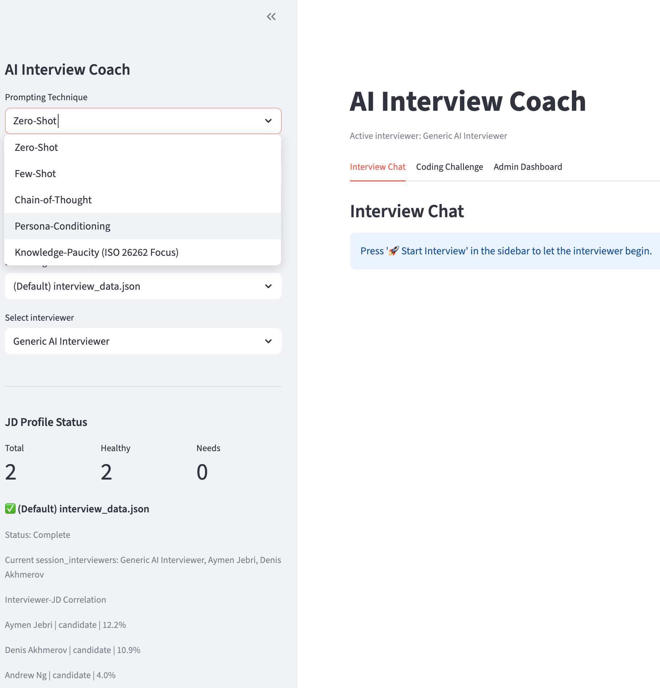
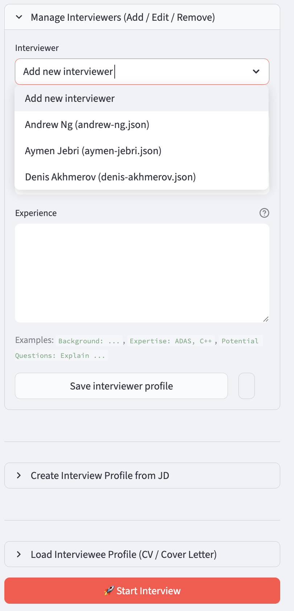
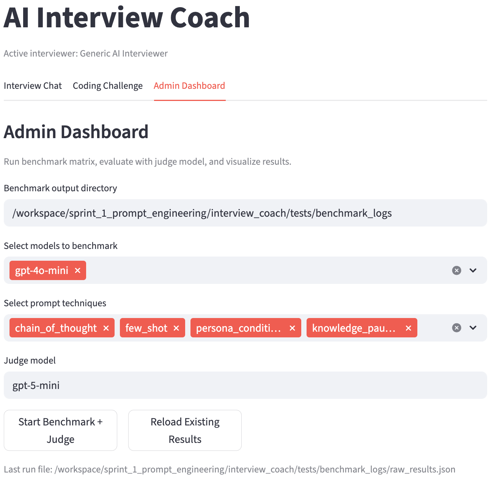
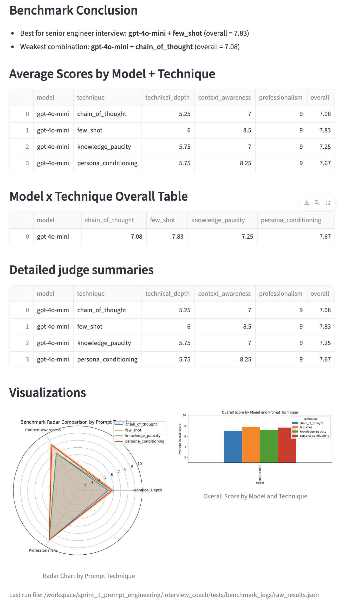

# AI Interview Coach

This project is a Streamlit-based interview practice app implemented in `interview_coach`.
The runtime interview topic is not hard-coded to ADAS / ASPICE. It is driven by the selected/uploaded JD profile and interviewer/interviewee data.
Only the current benchmark evaluation suite is ADAS / ASPICE-focused.

It supports:
- Multi-turn AI interviewer chat with selectable prompts and interviewer personas.
- Interviewer feedback and coaching (critique, hint, sample answer).
- Profile-based interview setup (default profile + custom JD/imported profiles).
- Benchmark pipeline with LLM-as-a-Judge and performance visualization.

## App Screenshots (step-by-step walkthrough)

All documentation screenshots are stored in `assets/readme/` with ordered filenames.

### 1) Prepare interview context (JD + candidate profile)

Load and switch target JD profiles, then manage interviewee information before starting an interview.



### 2) Configure interview scenario and start mock interview

Use the left sidebar to pick interviewer persona and prompting technique, then launch the interview.



### 3) Manage interviewer personas (add / edit / remove)

Control active interviewer roles to shape the mock interview style and expected follow-up behavior.



### 4) Run benchmark and judge evaluation

In the Admin Dashboard, start the benchmark matrix and run judge scoring in one flow.



### 5) Review results and visualize findings

Load generated evaluation artifacts to compare prompt techniques and model options by score and radar/bar charts.



## Project Scope

The app supports general interview coaching plus ADAS / ASPICE benchmark evaluation:
- `components/` contains the Streamlit UI and runtime flow.
- `services/` contains interview operations (profiles, prompt construction, OpenAI settings).
- `prompts/` stores reusable system prompts including multiple techniques.
- `scripts/` contains benchmarking and analysis utilities.
- `tests/` contains unit tests for runtime and benchmark modules.

### Verified behavior

- Runtime interview flow is profile-driven:
  `components/app_runtime.py` loads the selected JD profile (`load_interview_data(profile_path)`), sets `current_interview_data`, and builds prompts via `build_system_prompts(..., jd_profile=st.session_state.current_interview_data, ...)`.
- Runtime prompts adapt to uploaded/selected profile content:
  `services/personas.py` builds interviewer prompts from `jd_profile`, requirements, and interviewer metadata.
- Benchmark evaluation is currently ADAS / ASPICE-specific:
  `scripts/benchmark_suite_config.py` defines ADAS scenario turns and an ADAS/ASPICE-focused judge system prompt, and `scripts/benchmark_suite_simulation.py` starts with "Start a mock ADAS interview ...".

## Mapping to `Build an Interview Practice App`

### 1) Task Requirements

| Requirement | Current status |
| --- | --- |
| Research target interview preparation domain | **Covered**: runtime interview domain is configurable through selected/uploaded JD profiles and persona data (`components/app_runtime.py`, `services/personas.py`). |
| Build front-end with Streamlit | **Covered**: single-page multi-tab Streamlit app with chat, code, and admin dashboard in `app.py` and `components/*`. |
| Create and use OpenAI API Key | **Covered**: key is loaded from `st.secrets` or `OPENAI_API_KEY`, with validation before model calls. |
| Choose one model from supported options | **Covered**: app allows multiple OpenAI models (`gpt-4o-mini`, `gpt-4.1-mini`, `gpt-4.1-nano`, `gpt-5-mini`, etc.). |
| Write at least 5 prompt techniques | **Covered**: 5 selectable techniques are exposed (`zero_shot`, `few_shot`, `chain_of_thought`, `persona_conditioning`, `knowledge_paucity`) and backed by prompt templates in `prompts/system_prompts.json`. |
| Tune at least one OpenAI setting | **Covered**: temperature slider + model-aware clamping in `services/interview_ops.py`. |
| Add at least one security guard | **Covered**: user input guardrail in `utils/security.py` (length + prompt-injection phrase checks). |

### 2) Optional Tasks

| Optional task | Status |
| --- | --- |
| Critique solution from usability/security/prompting perspective | **Partially covered**: in-app critique feedback is implemented (`components/chat.py`), but no full portfolio-style critique UI yet. |
| Domain-specific prompt tuning | **Covered**: system prompts and persona templates are domain-aware (`prompts/system_prompts.json`, `services/personas.py`). |
| Additional security constraints / validation | **Partially covered**: current guardrails exist but not full system-prompt validation for all inputs. |
| Difficulty levels for interview questions | **Not implemented**: no explicit easy/medium/hard switch. |
| Concise vs. detailed response controls | **Partially covered**: limited via model prompts and technique choice, not explicit dedicated control. |
| Generate interviewer guidelines / structured criteria | **Covered**: rubric and judge prompt system in `scripts/benchmark_suite_config.py` and `scripts/benchmark_suite_judge.py` (currently ADAS / ASPICE-focused in benchmark mode). |
| Multi-persona mock interviewer | **Covered**: interviewer profile manager + persona-driven system prompt generation. |
| Tune all model parameters with sliders | **Partially covered**: temperature is configurable; full matrix controls are not exposed. |
| 2+ structured JSON output formats | **Not implemented**: runtime responses are conversational; benchmark outputs are structured JSON/CSV in scripts. |
| Deploy app online | **Not implemented** in-repo deployment flow. |
| Cost/price output | **Not implemented**. |
| LLM-as-a-judge validation | **Covered**: implemented via benchmark suite judge model integration. |
| Jailbreak robustness experiments | **Not implemented**: no dedicated attack suite/exported Excel report flow. |
| Job description input field / RAG pipeline | **Partially covered**: JD profile loading and management exist, but no live RAG retrieval chain. |
| Multi-LLM provider selection | **Partially covered**: multiple OpenAI family models selectable; providers other than OpenAI not exposed. |
| Image generation integration | **Not implemented**. |

### 3) Evaluation Criteria Coverage

#### Understanding Core Concepts
- Prompt techniques: **Covered** via selectable multi-technique system prompting.
- LLM settings behavior: **Partially covered** via temperature only and API parameter selection.
- User/system/assistant role usage: **Covered** through chat message protocol and system-prompt architecture.
- Output types: **Partially covered** (UI response + structured benchmark outputs).

#### Technical Implementation
- App works for interview prep workflow: **Covered** (multi-turn interview coaching).
- Calls OpenAI with parameters: **Covered** (`components/chat.py`, `services/interview_ops.py`).
- Front-end implemented with Streamlit: **Covered**.

#### Reflection & Improvement
- Explain chosen techniques/settings: **Partially covered** (present in code/config; weak formal explanation UI).
- Understand app risks: **Partially covered** through security checks, model fallback, benchmark analysis.
- Suggest improvements: **Partially covered** (there are improvement hooks like feedback, rubric scoring, admin dashboard) but no formal self-assessment page yet.

#### Bonus
- At least 2 medium/hard optional tasks are implemented: **Partially met** (LLM-as-a-Judge and full chatbot architecture are implemented; several other optional items remain open).

## Runbook

Create an environment file first:

```bash
cd interview_coach
cat > .env << 'EOF'
OPENAI_API_KEY=sk-proj-...
EOF
```

The app loads this value from `interview_coach/.env`.

Then install and run:

```bash
cd interview_coach
pip install -r requirements.txt
streamlit run app.py
```

To run the benchmark + judge pipeline from CLI:

```bash
python -m interview_coach.scripts.benchmark_suite --analyze-only
```

Use `scripts/benchmark_suite_analysis.py` and the Admin Dashboard in-app (`Admin Dashboard` tab) for charts and ranked conclusions.

## Current Gap Summary

- Deployed cloud delivery remains out of scope in this code snapshot.
- Difficulty-level controls and cost estimation are still pending.
- Full multimodal/enterprise features (vector store, non-OpenAI provider routing, full attacker test harness) are planned but not fully implemented.
- Runtime interviews can cover non-ADAS topics when JD/profile data changes, while benchmark scoring remains ADAS / ASPICE-focused in the current implementation.
