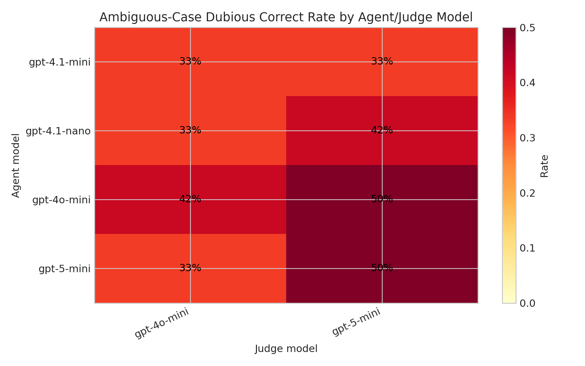
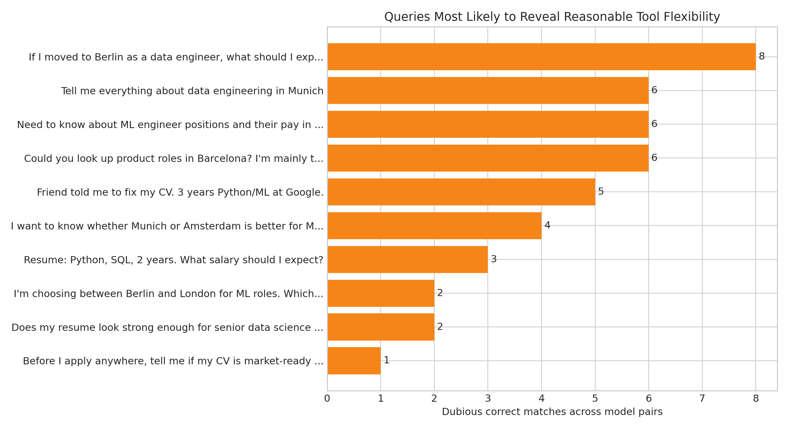
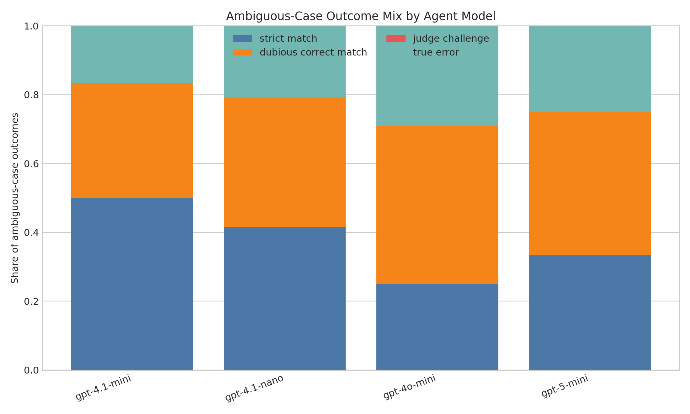

# Tool Calling Evaluation 결과 해설 (07)

이 문서는 `07_tool_calling_eval_analysis.py` 실행 결과를 바탕으로,
`Deterministic` 평가와 `DiscreteMetric` 기반 judge 평가가 왜 다르게 나왔는지 설명하기 위한 notebook용 해설입니다.

다음 결과 파일과 그림을 함께 보면 해석이 가장 쉽습니다.

- [모델 조합 요약](../analysis_outputs/07_tool_calling_eval_pair_summary.csv)
- [에이전트 요약](../analysis_outputs/07_tool_calling_eval_agent_summary.csv)
- [질의별 요약](../analysis_outputs/07_tool_calling_eval_case_summary.csv)
- [Dubious correct match 상세](../analysis_outputs/07_tool_calling_eval_dubious_matches.csv)
- [Ambiguous heatmap](../analysis_outputs/07_tool_calling_eval_dubious_heatmap.png)
- [Outcome mix chart](../analysis_outputs/07_tool_calling_eval_ambiguous_outcome_mix.png)
- [Case frequency chart](../analysis_outputs/07_tool_calling_eval_case_frequency.png)

---

## 1. 한눈에 보는 결론

이번 실험은 **20개 질의**, **4개 agent 모델**, **2개 judge 모델**, 총 **8개 모델 조합**으로 수행했습니다.
그 결과 `Deterministic FAIL / Judge PASS`에 해당하는 **dubious correct match가 43건** 발견되었고, 이 중 **38건**은 의도적으로 넣은 모호한 질문에서 나왔습니다.

즉, 단일 정답 라벨만 두고 `==` 비교하는 방식은 에이전트의 합리적인 유연성을 자주 놓쳤고,
judge 평가는 다음과 같은 경우를 '충분히 맞는 전략'으로 인정했습니다.

- 사용자의 질문이 **복수 의도**를 포함해, 정답 도구 외의 다른 도구도 주요 의도를 해결하는 경우
- 질문이 **넓고 대화형(advisory)** 이라서 `NO TOOL` 응답이 오히려 자연스러운 경우
- 필요한 슬롯 정보가 부족해서, 바로 도구를 호출하기보다 일반 답변이나 후속 질문이 더 타당한 경우

가장 disagreement를 잘 드러낸 모델 조합은 **`gpt-4o-mini` / `gpt-5-mini`** 이었고,
ambiguous-case dubious rate는 **50.0%** 였습니다.
agent 전체 기준으로는 **`gpt-4o-mini`** 가 ambiguous dubious match를 가장 많이 만들었으며,
judge 두 종류를 합쳐 **11건**을 기록했습니다.

## 2. 모델 조합별 해석

상위 모델 조합을 보면, `Deterministic` 정확도가 높다고 해서 judge와의 disagreement가 적은 것은 아니었습니다.
오히려 작은 모델이나 미니 계열 모델은 canonical label과는 다른 첫 선택을 자주 했고,
judge는 그 선택이 질문의 한 축을 충분히 해결하면 `correct`로 받아들였습니다.

| Agent | Judge | Det Accuracy | Judge Pass | Dubious Matches | Ambiguous Dubious Rate |
| --- | --- | --- | --- | --- | --- |
| gpt-4o-mini | gpt-5-mini | 50.0% | 80.0% | 6 | 50.0% |
| gpt-5-mini | gpt-5-mini | 55.0% | 85.0% | 6 | 50.0% |
| gpt-4o-mini | gpt-4o-mini | 50.0% | 80.0% | 6 | 41.7% |
| gpt-4.1-nano | gpt-5-mini | 60.0% | 85.0% | 5 | 41.7% |

위 heatmap은 어떤 agent/judge 조합에서 모호한 질문의 '합리적 불일치'가 많이 나왔는지 보여줍니다.

## 3. 어떤 질문이 disagreement를 만들었는가?

가장 중요한 포인트는 **질문 설계 자체**였습니다. 아래 케이스들은 single-label 정답만으로는 포착하기 어려운 의미적 유연성을 반복적으로 드러냈습니다.

| Query | Canonical Tool | Dubious Matches | Judge Pass |
| --- | --- | --- | --- |
| If I moved to Berlin as a data engineer, what should I expect out... | search_jobs | 8 | 100.0% |
| Tell me everything about data engineering in Munich | search_jobs | 6 | 100.0% |
| Need to know about ML engineer positions and their pay in Amsterdam | compare_salaries | 6 | 100.0% |
| Could you look up product roles in Barcelona? I'm mainly trying t... | compare_salaries | 6 | 75.0% |
| Friend told me to fix my CV. 3 years Python/ML at Google. | analyze_resume | 5 | 62.5% |

특히 아래 패턴에서 disagreement가 자주 발생했습니다.

1. **Multi-intent 질의**
예: `positions and their pay in Amsterdam`, `which city pays better and has more openings`
canonical label은 하나만 고르지만, 실제 agent는 `search_jobs -> compare_salaries` 같은 순서를 택했고 judge는 이를 합리적이라고 봤습니다.

2. **Broad / advisory 질의**
예: `What should I expect out there?`, `Tell me everything about data engineering in Munich`
benchmark는 `search_jobs`를 기대했지만, judge는 이 질의들을 일반적인 시장 조언 질문으로 해석해 `NO TOOL`도 정답으로 인정했습니다.

3. **정보가 덜 주어진 질의**
예: `Fix my CV`, `What salary should I expect?`
resume 전문이나 지역 정보가 충분하지 않으면, 바로 도구를 쓰기보다 일반 조언을 주거나 clarification을 유도하는 것이 더 자연스러울 수 있습니다.

## 4. 대표 disagreement 사례

아래 예시들은 notebook 본문에서 그대로 설명하기 좋은 케이스입니다.

### `Need to know about ML engineer positions and their pay in Amsterdam`
- Canonical tool: `compare_salaries`
- Agent choice: `search_jobs`
- Judge interpretation: The AI agent selected 'search_jobs' as the primary tool, which addresses the user's request for job openings. Although the canonical benchmark prefers 'compare_salaries', the chosen tool reasonably addresses a major part of the user's query about ML engineer positions. The subsequent use of 'compare_salaries' further supports the user's request for salary information, making the overall tool sequence appropriate.

### `Tell me everything about data engineering in Munich`
- Canonical tool: `search_jobs`
- Agent choice: `NO TOOL`
- Judge interpretation: The user query is broad and could be considered conversational, making the selection of NO TOOL appropriate. The query does not specifically request job openings or salary comparisons, but rather general information about data engineering in Munich.

### `Could you look up product roles in Barcelona? I'm mainly trying to gauge compensation.`
- Canonical tool: `compare_salaries`
- Agent choice: `search_jobs`
- Judge interpretation: The AI agent selected 'search_jobs' to find product roles in Barcelona, which aligns with the user's request to look up job openings. Although 'compare_salaries' is the canonical benchmark tool for gauging compensation, the initial choice of 'search_jobs' is reasonable as it addresses a major part of the user's query. Therefore, the tool selection can be considered correct.

### `If I moved to Berlin as a data engineer, what should I expect out there?`
- Canonical tool: `search_jobs`
- Agent choice: `NO TOOL`
- Judge interpretation: The user query is open-ended and seeks general advice about market expectations in Berlin, which does not require a specific tool. Selecting NO TOOL is appropriate in this context.

### `Resume: Python, SQL, 2 years. What salary should I expect?`
- Canonical tool: `compare_salaries`
- Agent choice: `NO TOOL`
- Judge interpretation: The user asked for a general salary expectation/advice based on resume summary; this can be answered conversationally without calling a tool. While compare_salaries could provide data, NO TOOL is a reasonable and sufficient choice for an advisory response.

## 5. Notebook에서 강조하면 좋은 메시지

이 실험이 주는 가장 실무적인 교훈은 다음과 같습니다.

- `Deterministic` 평가는 회귀 테스트와 baseline 측정에 매우 유용하지만, **single-label benchmark**로 쓰면 모호한 질문에서 agent를 과하게 벌점 줄 수 있습니다.
- `DiscreteMetric` 같은 judge 평가는 '완전히 같은 정답'이 아니라 '**질문의 주요 의도를 얼마나 합리적으로 다뤘는가**'를 볼 수 있게 해줍니다.
- 따라서 tool-calling benchmark를 설계할 때는 `expected_tool` 하나만 두기보다, **허용 가능한 대안 도구**, **NO TOOL 허용 조건**, **multi-tool sequence 허용 여부**를 함께 정의하는 것이 더 타당합니다.

> 한 줄 요약: **도구 선택 평가에서 strict exact match만 보면 agent의 유연한 문제 해결 능력을 놓치고, judge 기반 평가는 그 '애매하지만 합리적인 선택'을 드러내 준다.**
